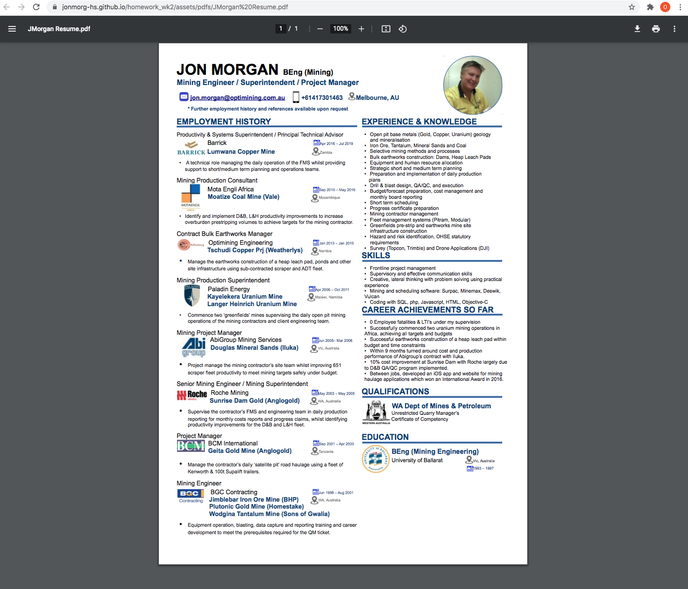

# PORTFOLIO PAGE

Homework requirements completed were:

1. Updated Portfolio page:

Links for contacts (call and email), Github, LinkedIn and Twitter

2. Updated Github profile with Project 1 and two homework assignments pinned

Added Company Icon as photo/avator.
Added Biography
Added company email address
Added link to portfolio website
Pinned Project and two homework assignments
Added 3 followers (Project1 Contributors)

3. Updated Portfolio page with downloadable link to my resume

4. Updated LinkedIn profile

Examples of student work are accessible from the linked Github page.

https://jonmorg-hs.github.io/homework_wk2/

